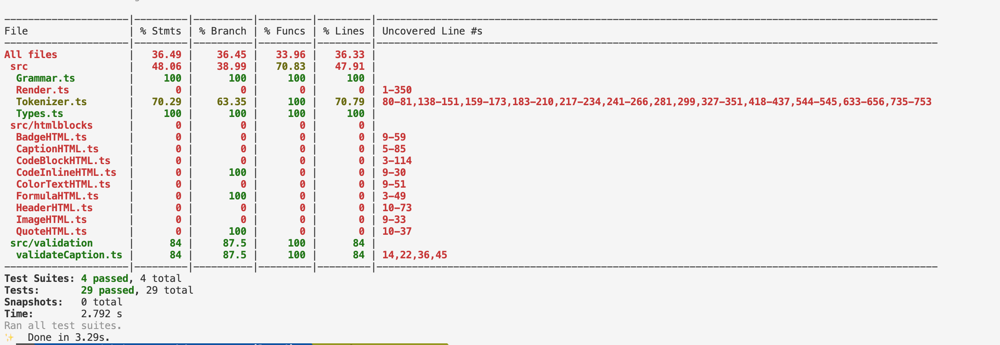

                            _       _
       _ __ ___   __ _ _ __| | ____| | _____      ___ __  
      | '_ ` _ \ / _` | '__| |/ / _` |/ _ \ \ /\ / / '_ \ 
      | | | | | | (_| | |  |   < (_| | (_) \ V  V /| | | |
      |_| |_| |_|\__,_|_|  |_|\_\__,_|\___/ \_/\_/ |_| |_|

                                      _ _       
             ___ ___  _ __ ___  _ __ (_) | ___ _ __ 
            / __/ _ \| '_ ` _ \| '_ \| | |/ _ \ '__|
           | (_| (_) | | | | | | |_) | | |  __/ |
            \___\___/|_| |_| |_| .__/|_|_|\___|_|
                               |_|               

## Markdown Typescript Compiler


[DEMO](https://meugenom.github.io/markdown-ts-compiler/)

## IMPORTANT!

**The codebase for the Project is entirely hand-coded.**
Every line of code in the project was crafted by  a human developer.
NO AI-generated Code was used in the development of this project.
AI was strictly utilized only for architectural brainstorming and refining complex regular expression.

## Core Architecture

**Two-Pass parsing Strategy**
1. Markdown Text -> AST (Abstract Syntax Tree)
    - **First-Pass:** The engine scans document to identify high-level structural blocks (e.g., caption, headers, lists, code blocks, tables) and generates a token stream.
    - **Second-Pass:** (Recursive Inline Parsing) Content within blocks is processed through a recursive function. The engine handles deeply nested inline elements (e.g., links, images, bold text, underline text, formulas) with high precision.
2. AST -> HTML 
    - The final output is generated wia recursive tree-walk of the AST, ensuring that complex hierarchies are translated into valid, semantic HTML.

## Testing

The Core AST generation logic is tested to parsing stability and regression prevention:
- **70% Code Coverage** Focus is placed on critical structural components.
- **Core Block Testing** High priority modules (tables, headers, lists, caption)



## Technologies Used:

- npm v10.8.2, node v20.20.0
- Typescript v5.3.2
- Webpack v5.105.3
- TS-Loader v9.5.4
- Tailwind CSS from [website](https://tailwindcss.com) v4.0.12
- Shiki v.4.0.2
- Katex v.0.16.33
- Jest v.30.2.0

## How to use it:

1. Clone the repository:
2. Install the dependencies:
    ```bash
    yarn
    ```
3. Run the compiler:
    ```bash
    yarn build
    ```

4. For testing use command:
    ```bash
    yarn test
    ```

## API Reference:
 Please see entrypoint `./src/index.ts` for the API reference.
 
 **API** functions:
- _convertMDtoHTML(txt: string)_ - converts markdown text into HTML, return HTML string
- _convertMDtoTokens(txt: string)_ - converts markdown text into tokens, return array of tokens
- _convertMDtoAST(txt: string)_ - converts markdown text into AST, return Abstract Syntax Tree

## How to use it in your project:

**Directories:**
- `./src` - the main compiler code:
    - `../test` - the test code
    - `../htmlblocks` - the html blocks to parse AST into HTML
    - `../content` - the example text to parse
    - `../static` - the static files index.html, css styles
    - `../types` - integration with external libraries
    
- `/dist` - the compiled code and static files, need to run build command‚

**Files:**
- `./src/index.ts` - the entrypoint of the comiler
- `./src/Grammar.ts` - the grammar with Regexp rules
- `./src/Tokenizer.ts` - the tokenize class to make AST from MD text
- `./src/Render.ts` - the compiler class to compile AST into HTML


### Author:

[meugenom](https://meugenom.com)

